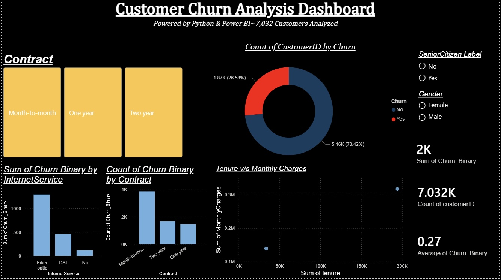

# 📉 Customer Churn Analysis — Telecom Industry

An end-to-end data analytics project analyzing customer 
churn behavior in a telecom dataset to identify key drivers 
of attrition, predict churn using Machine Learning, and 
provide actionable business retention strategies.

---

## 📌 Project Overview

Customer churn is one of the most expensive problems in 
telecommunications. Losing a customer means losing not just 
their monthly revenue — but their entire lifetime value.

This project explores why customers leave, which segments 
are most at risk, and what the business can do about it.

The analysis covers 7,032 telecom customers, examining 
contract types, internet service, monthly charges, tenure, 
and demographic data to surface high-risk churn segments — 
and builds a Logistic Regression model achieving 79.2% 
prediction accuracy.

## 📊 Dashboard Preview

## 📈 Key Results
- Model Accuracy: 79.2%
- Overall Churn Rate: 26.58%
- Total Records Analyzed: 7,032
- Month-to-month contracts: Highest churn risk
- Fiber optic customers churn more than DSL users
- Senior citizens show higher churn tendency

 ## 🛠 Skills Demonstrated

- Data Cleaning & Preprocessing (Python & Pandas)
- Exploratory Data Analysis (EDA)
- Customer Segmentation Analysis
- Churn Rate Calculation & KPI Development
- Feature Engineering (10+ derived features)
- Machine Learning (Logistic Regression, Scikit-learn)
- Data Visualization (Matplotlib, Seaborn)
- Dashboard Development (Power BI, DAX)
- Business Insight Generation & Retention Strategy

---

## 🎯 Business Questions Answered

- What is the overall churn rate?
- Which contract type has the highest churn?
- Does internet service type influence churn?
- Do higher monthly charges lead to more churn?
- How does tenure affect churn likelihood?
- Do senior citizens churn more than non-seniors?
- Can we predict which customer will churn next?

---

## 🛠️ Tools Used

| Tool | Purpose |
|------|---------|
| Python 3.14 | Data cleaning, EDA, ML model |
| Pandas & NumPy | Data manipulation & analysis |
| Matplotlib & Seaborn | Static visualizations & charts |
| Scikit-learn | Logistic Regression ML model |
| Power BI | Interactive dashboard & KPI cards |
| Jupyter Notebook | Development environment |

## 🗂 Project Structure
- churn_analysis.ipynb — Complete Python analysis
- churn_clean.xlsx — Cleaned dataset (7,032 rows)
- Dashboard-Overview-Analysis.jpg — Power BI Dashboard screenshot (Overall)
- Month-To-Month-Dashboard-Overview-Analysis.jpg — Power BI Dashboard screenshot (Monthly)
- One-Year-Dashboard-Overview-Analysis.jpg — Power BI Dashboard screenshot (One Year)
- Two-Year-Dashboard-Overview-Analysis.jpg — Power BI Dashboard screenshot (Two Year)
- churn_analysis.html — Notebook in HTML format

---

## 📊 Dataset

- **Source:** Telco Customer Churn Dataset — Kaggle
- **Rows:** 7,032 customers (after cleaning)
- **Original rows:** 7,043 (11 removed — missing TotalCharges)

| Column | Description |
|--------|-------------|
| customerID | Unique customer identifier |
| gender | Male / Female |
| SeniorCitizen | 1 = Senior, 0 = Non-senior |
| tenure | Months as a customer |
| Contract | Month-to-month / One year / Two year |
| InternetService | DSL / Fiber optic / No |
| MonthlyCharges | Monthly bill amount ($) |
| TotalCharges | Total amount charged ($) |
| Churn | Target — Yes = churned, No = retained |

---

## 🔄 Workflow

 Python EDA  →  Data Cleaning  →  ML Model  →  Power BI
─────────────────────────────────────────────────────
Raw review     Remove nulls      Train/Test    KPI cards
Load data      Fix dtypes        Logistic Reg  Donut chart
Explore data   Engineer cols     79.2% acc     Bar charts
Visualize      Export Excel      Predictions   Slicers

---

## 🔍 Key Findings

### 1. Overall Churn Rate
**26.58%** of customers churned — 1,869 out of 7,032 
customers left the telecom provider.

### 2. Churn by Contract Type

| Contract | Churn Rate |
|----------|-----------|
| 🔴 Month-to-month | ~42% |
| 🟡 One year | ~11% |
| 🟢 Two year | ~3% |

Month-to-month customers churn at **14x the rate** of 
two-year contract customers.

### 3. Churn by Internet Service

| Service | Churn Rate |
|---------|-----------|
| 🔴 Fiber optic | ~42% |
| 🟡 DSL | ~19% |
| 🟢 No internet | ~7% |

Fiber optic customers churn at **6x the rate** of customers 
with no internet service.

### 4. Churn by Senior Citizen Status

| Segment | Churn Rate |
|---------|-----------|
| 🔴 Senior Citizens | ~41% |
| 🟢 Non-Senior Citizens | ~24% |

Senior citizens churn at **1.7x the overall baseline**.

### 5. Monthly Charges vs Churn

Churned customers pay significantly higher monthly charges 
on average than retained customers — the business is losing 
its highest-paying relationships.

### 6. Tenure vs Churn

Customers in their **first 12 months** show the highest 
churn risk. After 24+ months, churn rate drops significantly 
— early engagement is critical.

---

## 💡 Business Recommendations

### 1. Incentivize Long-Term Contracts
Month-to-month churn at ~42% is unsustainable. Offer 
discounted rates or loyalty rewards to encourage customers 
to switch to annual or two-year contracts.

### 2. Investigate Fiber Optic Service Quality
42% churn among fiber optic users suggests pricing, 
reliability, or service quality issues. Customer exit 
surveys should be conducted immediately for this segment.

### 3. Build a Senior Citizen Retention Programme
At 41% churn, senior citizens are the highest-risk 
demographic. Dedicated support lines, simplified plans, 
and exclusive senior rates could significantly reduce 
attrition in this segment.

### 4. Implement Early Warning System
Customers in their first 12 months are most at risk. 
An automated flag for customers showing disengagement 
signals (missed payments, low usage) within the first 
6 months should be introduced as a priority.

### 5. Review High Monthly Charge Pricing
Churned customers consistently show higher monthly charges. 
A competitive pricing review and personalised discount 
offers for at-risk high-paying customers could protect 
significant revenue.

---

## 🤖 Machine Learning Model

| Detail | Value |
|--------|-------|
| Algorithm | Logistic Regression |
| Training Data | 80% — 5,625 records |
| Testing Data | 20% — 1,407 records |
| **Model Accuracy** | **79.2%** |
| Precision (Stayed) | 0.84 |
| Precision (Churned) | 0.63 |
| Recall (Stayed) | 0.89 |
| Recall (Churned) | 0.52 |

---

## 📈 Power BI Dashboard

The interactive dashboard includes:

- **Overview:** Total customers, churn rate KPI, 
  active vs churned donut chart, contract slicer
- **Segment Analysis:** Churn by internet service, 
  contract type, tenure vs monthly charges scatter
- **Filters:** Gender slicer, SeniorCitizen slicer

To view: download `ChurnDashboard.pbix` and open 
with Power BI Desktop (free).

---

## 🐍 Running the Python Notebook

# 1. Clone this repo
git clone https://github.com/paragbanerjee999/
Customer-Churn-Analysis.git

# 2. Install dependencies
pip install pandas numpy matplotlib seaborn 
scikit-learn plotly openpyxl jupyter

# 3. Launch the notebook
jupyter notebook notebooks/churn_analysis.ipynb

Make sure data/churn_clean.xlsx is present 
before running.

---

## 👤 Author

**Parag Banerjee**
- 🎓 B.Tech CSE — Techno India University (2027)
- 💼 LinkedIn: linkedin.com/in/parag-banerjee-b58654341
- 📧 Email: paragbanerjee999@gmail.com
- 🌐 GitHub: github.com/paragbanerjee999
